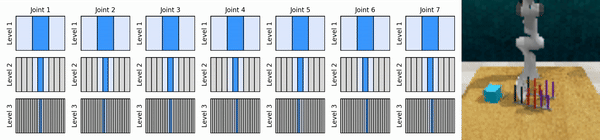
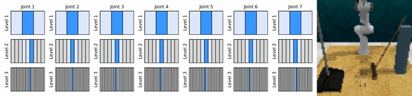

# Physics Informed Learning for Continuous Control Policies

[](https://arxiv.org/abs/XXXX.XXXXX)
[](LICENSE)
[](https://www.python.org/downloads/release/python-3100/)

Official implementation of **Physics Informed Learning for Continuous Control Policies**
(*Pi-ARSQ* and *Pi-CQN_AS*), introducing a control-theoretically motivated geometric
regularizer derived from the Hamilton–Jacobi–Bellman (HJB) inequality for hierarchical
value-based reinforcement learning.

> **Hrishikesh Viswanath, Mihir Chauhan, Aniket Bera.**
> *Physics Informed Learning for Continuous Control Policies.*

<p align="center">
  
  
</p>

## Abstract

Continuous control in reinforcement learning is a challenging task, often requiring
large amounts of interaction data, particularly in sparse-reward settings where
informative signals are limited. Recent value-based approaches mitigate this by
decomposing the action space into hierarchical structures, but they typically rely
on empirical data to learn action dependencies, without explicitly enforcing
consistency with the underlying system dynamics. We introduce a control-theoretically
motivated geometric regularizer for continuous control policies. Using a short-time
approximation, we obtain a physics-informed constraint that links local variations
in the value function to instantaneous cost, encouraging geometrically consistent
value estimates without requiring explicit derivative computation or manual reward
shaping. We apply this regularization to both temporal (`CQN_AS`) and autoregressive
(`ARSQ`) action parameterizations and evaluate it across the RLBench, D4RL, and
real-world Franka manipulation domains.

## Key Results

| Domain                  | Metric                    | Baseline      | **Ours (Pi-ARSQ)** |
|-------------------------|---------------------------|--------------:|-------------------:|
| RLBench (15 tasks)      | Mean success rate (%)     | 63.2 (ARSQ)   | **69.2**           |
| RLBench (15 tasks)      | Mean episode length       | 97.4 (ARSQ)   | **92.9**           |
| D4RL (5 datasets)       | Mean normalized return    | 81.3 (ARSQ)   | **85.4**           |

See Tables I–III of the paper for per-task results, baselines, and Eikonal ablations.

## Repository Layout

```
.
├── ARSQ-main/                       # Upstream ARSQ baselines (Liu et al., 2025)
│   ├── d4rl/                        #   D4RL implementation
│   └── rlbench/                     #   RLBench implementation
├── phys_fk_continuous_control-main/ # Pi-ARSQ / Pi-CQN_AS implementation
│   ├── d4rl/                        #   Geometric regularization on D4RL
│   └── rlbench/                     #   Geometric regularization on RLBench
├── arsq_src/                        # Shared ARSQ modules (encoder, replay, sqar)
├── rlbench_src/                     # CQN-AS RLBench environment + agent
├── bigym_src/, dmc_src/,            # Auxiliary environment wrappers
│   humanoid_src/
├── cfgs/                            # Hydra task configs
├── simtoreal/                       # Real-robot Franka deployment (Section V)
├── media/                           # Figures and demo videos
└── train_*.py                       # Top-level training entrypoints
```

The two principal contributions of the paper live in
`phys_fk_continuous_control-main/` (geometric regularizer for D4RL and RLBench)
and `simtoreal/` (real-world Franka validation). The `ARSQ-main/` directory is
included verbatim from the upstream ARSQ release as a reproducible baseline.

## Installation

We recommend separate conda environments per benchmark, since each depends on a
different simulator stack. Follow the corresponding sub-README:

| Domain                | Instructions                                              |
|-----------------------|-----------------------------------------------------------|
| **D4RL (offline)**    | [`phys_fk_continuous_control-main/d4rl/`](phys_fk_continuous_control-main/d4rl) |
| **RLBench (pixel)**   | [`phys_fk_continuous_control-main/rlbench/`](phys_fk_continuous_control-main/rlbench) |
| **Real Franka Panda** | [`simtoreal/README.md`](simtoreal/README.md)              |

A minimal shared environment is provided in `conda_env.yml`:

```bash
conda env create -f conda_env.yml
conda activate cqn_as
```

## Quick Start

### D4RL (Pi-ARSQ, offline locomotion)

```bash
cd phys_fk_continuous_control-main/d4rl
python arsq_d4rl/run/sqar_run.py \
    env_cfg@_global_=hmr \
    use_fk_reg=true \
    wandb.name=pi-arsq-hopper-medium-replay \
    seed=0
```

### RLBench (Pi-ARSQ / Pi-CQN_AS, pixel manipulation)

```bash
cd phys_fk_continuous_control-main/rlbench
source set_env.sh
DISPLAY=:99.0 python arsq_rlb/runner/train_rlbench_sqar.py \
    rlbench_task=open_oven \
    use_fk_reg=true \
    wandb.name=pi-arsq-open_oven \
    seed=0
```

### Real Franka Panda

```bash
cd simtoreal
# 1. Record kinesthetic / waypoint demonstrations
python record_waypoints.py --robot-ip <IP> --num-demos 10 \
    --save-dir ../runs/task/waypoints

# 2. Capture camera demos via autonomous replay
python train_real.py --agent arsq --demo-mode waypoint \
    --waypoint-dir ../runs/task/waypoints \
    --demo-dir     ../runs/task/demos \
    --save-dir     ../runs/task

# 3. Train Pi-ARSQ (offline, demo-only) and evaluate
python train_real.py --agent arsq --use-fk-reg \
    --load-demos-only --offline \
    --demo-dir ../runs/task/demos \
    --save-dir ../runs/task/pi_arsq

python eval_real.py --agent arsq \
    --snapshot     ../runs/task/pi_arsq/snapshot.pt \
    --action-stats ../runs/task/pi_arsq/action_stats.npz \
    --num-episodes 10
```

The complete real-robot procedure — including the comparison runbook for
*CQN-AS*, *ARSQ-base*, and *Pi-ARSQ* — is documented in
[`simtoreal/RUNBOOK.md`](simtoreal/RUNBOOK.md).

## Reproducing Paper Results

| Table / Figure                                  | Script                                                                    |
|-------------------------------------------------|---------------------------------------------------------------------------|
| Table I  (RLBench, 15 tasks)                    | `phys_fk_continuous_control-main/rlbench/train_ablations.sh`              |
| Table II (D4RL, 5 datasets)                     | `phys_fk_continuous_control-main/d4rl/d4rl_manager.sh`                    |
| Table III (Episode length, RLBench)             | Re-uses Table I checkpoints (eval-only)                                   |
| Real-robot validation (Section V)               | `simtoreal/RUNBOOK.md`                                                    |

The geometric regularizer is enabled via the `use_fk_reg=true` Hydra flag (sim)
or `--use-fk-reg` CLI flag (real robot), with hyperparameters
`fk_weight`, `kappa`, `nu`, and `num_walks` matching the values reported in the
paper appendix.

## Citation

If you use this code in your research, please cite:

```bibtex
@article{viswanath2026pi,
    title   = {Physics Informed Learning for Continuous Control Policies},
    author  = {Viswanath, Hrishikesh and Chauhan, Mihir and Bera, Aniket},
    journal = {arXiv preprint},
    year    = {2026}
}
```

The implementation builds on the following baselines, which should also be cited:

```bibtex
@article{seo2024continuous,
    title   = {Continuous Control with Coarse-to-fine Reinforcement Learning},
    author  = {Seo, Younggyo and others},
    journal = {arXiv preprint arXiv:2407.07787},
    year    = {2024}
}

@article{liu2025learning,
    title   = {Learning from Suboptimal Data in Continuous Control via
               Auto-Regressive Soft Q-Network},
    author  = {Liu and others},
    journal = {arXiv preprint arXiv:2502.00288},
    year    = {2025}
}
```

## Acknowledgements

This codebase builds on the public implementations of
[CQN](https://github.com/younggyoseo/CQN) /
[CQN-AS](https://github.com/younggyoseo/CQN-AS) and
[ARSQ](https://github.com/CornellRL/ARSQ). We thank the authors for releasing
their work.

## License

Released under the MIT License — see [LICENSE](LICENSE) for details. Sub-modules
in `ARSQ-main/` and `phys_fk_continuous_control-main/` retain their original
upstream licenses.
